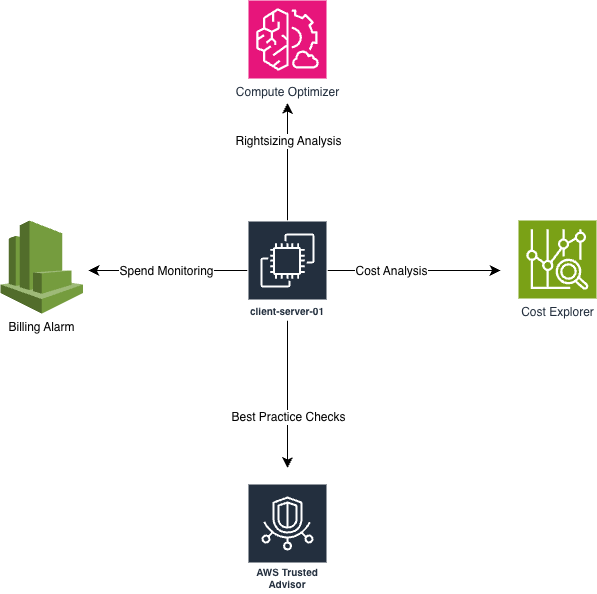

# AWS Cloud Cost Optimization Audit

## Business Problem
Organizations migrating to or operating in the cloud
frequently overspend due to unmonitored resources,
lack of tagging governance, and absence of cost
anomaly detection. This project demonstrates a
complete cloud cost audit methodology applied to
a live AWS environment.

## Architecture

## AWS Services Used
- AWS Cost Explorer
- AWS Cost Anomaly Detection
- AWS Trusted Advisor
- AWS Compute Optimizer
- Amazon CloudWatch
- Amazon EC2
- Amazon S3

## Scope of Work
Full cost posture audit across compute, storage, and
supporting services. Evaluated active service inventory,
resource tagging compliance, cost monitoring controls,
and optimization opportunities.

## Outcomes
- Identified 12 active services across the environment
- Discovered 4 unintended active services requiring
  investigation
- Identified complete absence of resource tagging
  strategy across all resources
- Implemented cost anomaly detection with automated
  alerting
- Deployed mandatory tagging across all resources
- Produced prioritized findings report with 4 findings
  and actionable remediation steps

## AWS Skills Demonstrated
AWS Cost Explorer · Cost Anomaly Detection · Trusted
Advisor · Compute Optimizer · CloudWatch Billing Alarms
· Resource Tagging · FinOps · IAM · S3 · EC2

## Note
Full audit methodology, report templates, and findings
documentation are maintained privately as proprietary
business assets.
